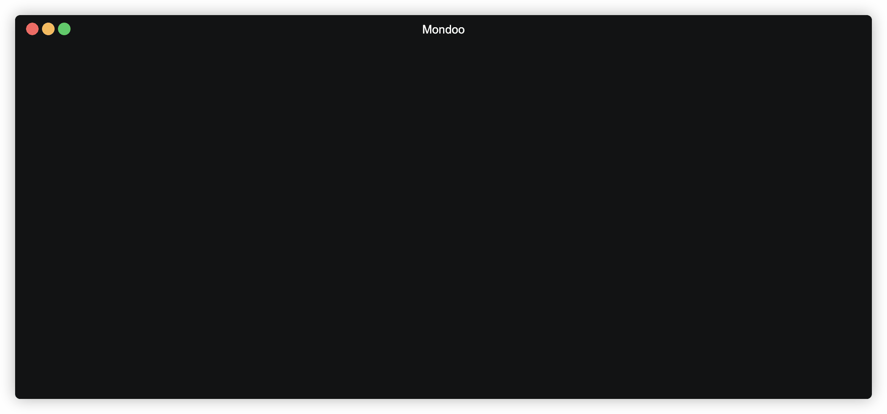

# Cloud Workload Security

## Azure Instances


```bash
az login
```

You need your subscription id and the resource group. Run `az account list` and ` az vm list` to determine those values:

```bash
$ az account list
Name                  CloudName    SubscriptionId                        State    IsDefault
--------------------  -----------  ------------------------------------  -------  -----------
Azure subscription 1  AzureCloud   10192451-09aa-4782-1016-1cdfede1026b  Enabled  True

$ az vm list
Name     ResourceGroup    Location    Zones
-------  ---------------  ----------  -------
centos   DEMO             westus
ubuntu   DEMO             westus
win2019  DEMO             westus
```

Then scan your resource group via:

```
$ mondoo scan -t az://subscriptions/subscriptionid/resourceGroups/groupname
```

This will determine all instances running in Azure and try to connect via SSH.

> Note: we recommend to use ssh config to configure the login usernames and ssh-agent to manage your credentials

Further information is available at [Integration/Cloud/Azure](../cloud/azure.md#azure-integration)

## AWS EC2 Instances


Configure your AWS credentials in `~/.aws/credentials`. If required, set the `AWS_PROFILE` and `AWS_REGION`:

```bash
$ export AWS_PROFILE=mondoo
$ export AWS_REGION=us-east-1
```

Now, scan instances in your region via:

```
$ mondoo scan -t ec2://user/ec2-user
```

This will determine all instances running in AWS and try to connect via SSH.

You can also overwrite the region and profile via the mondoo target identifier:

```bash
$ mondoo scan -t ec2://profile/name/region/us-east-1
$ mondoo scan -t ec2://region/us-east-1
$ mondoo scan -t ec2://profile/mondoo-inc/region/us-east-1/user/ec2-user
```

To scan individual instances, use:

```
$ mondoo scan -t ssh://ec2-user@52.51.185.215
$ mondoo scan -t ssh://ec2-user@52.51.185.215:2222
```

> Note: we recommend to use ssh config to configure the login usernames and ssh-agent to manage your credentials

Further information is available at [Integration/Cloud/AWS](../cloud/aws.md#aws-integration)

## GCP Instances



Install the [gcloud](https://cloud.google.com/sdk/install) CLI and [log in](https://cloud.google.com/sdk/gcloud/reference/auth/login) via `gcloud auth login`. Then set your project:

```bash
$ gcloud config set project <projectID>
Updated property [core/project].
```

Then list all instances:

```bash
gcloud compute instances list
```

Then scan all instances:

```
$ mondoo scan -t gcp://
```

You can also override the GCP project via the mondoo target identifier:

```
mondoo scan -t gcp://project/projectid
```

To scan individual instances, use:

```
$ mondoo scan -t ssh://user@52.51.185.215
$ mondoo scan -t ssh://user@52.51.185.215:2222
```

> Note: we recommend to use ssh config to configure the login usernames and ssh-agent to manage your credentials


Further information is available at [Integration/Cloud/GCP](../cloud/gcp.md#gcp-integration)