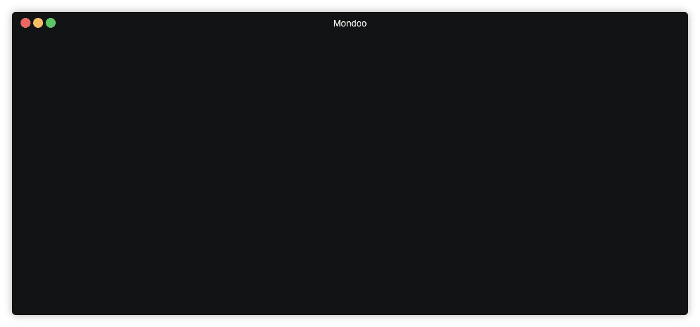

# Container Security

## Kubernetes


Ensure you can connect to your cluster via `kubectl`:

```bash
kubectl get pods
NAME                          READY   STATUS                 RESTARTS   AGE
centos-6b88594b-jm7bp         0/1     CreateContainerError   0          5d1h
hello-node-7676b5fb8d-xck5l   1/1     Running                0          5d1h
```

Then you can scan your cluster via:

```
$ mondoo scan -t k8s://
```

You can also override the context and the namespace:

```bash
$ mondoo scan -t k8s://context/c1
$ mondoo scan -t k8s://context/c1/namespace/n1
$ mondoo scan -t k8s://namespace/n1
```

Further information is available at [Integration/Cloud/K8S](../cloud/k8s.md#k8s-integration)

## Docker Images


Mondoo can scan Docker container images directly via their registry name:

```
$ mondoo scan -t docker://ubuntu:latest
$ mondoo scan -t docker://elastic/elasticsearch:7.2.0
$ mondoo scan -t docker://gcr.io/google-containers/ubuntu:14.04
$ mondoo scan -t docker://registry.access.redhat.com/ubi8/ubi
```

If the Docker agent is installed, you can scan images by their id:

```
$ mondoo scan -t docker://docker-image-id
```

## Docker Container



You can easily scan running containers by their id:

```
$ mondoo scan -t docker://docker-container-id
```

Scans also work for stopped containers.


> Note: Docker container can only be scanned if the Docker engine is installed

